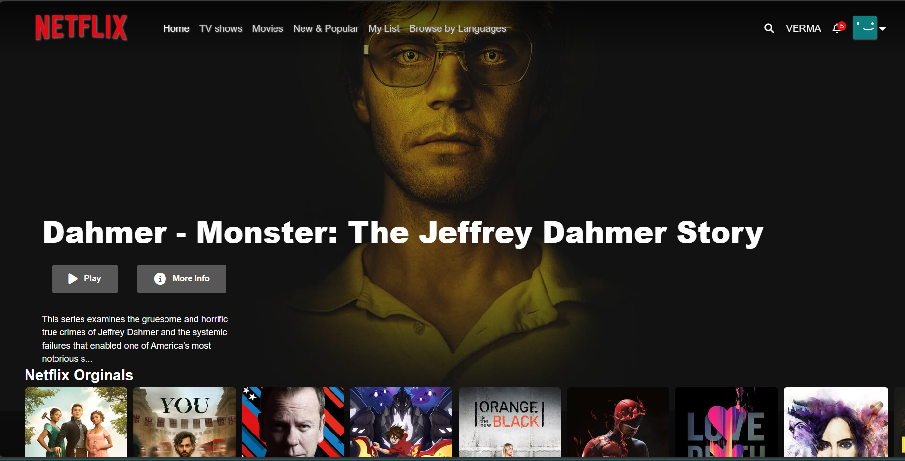

# Netflix Clone

A simple Netflix clone application built using HTML, CSS, jQuery, and JavaScript. This project is a front-end replication of Netflix's UI, showcasing various movies and TV shows.




## Features

- Responsive design
- Movie/TV show posters
- Hover effects to display additional information
- Carousel for featured content
- Search functionality

## Demo

You can check out the live demo of the application [here](https://netflixclonev3rma.vercel.app/).

## Installation

1. Clone the repository:

    ```bash
    git clone https://github.com/v3rma9579/Netflix-Clone.git
    ```

2. Navigate to the project directory:

    ```bash
    cd Netflix-Clone
    ```

## Usage

Open `index.html` in your favorite web browser to view the app.

## Technologies Used

- **HTML5**: For the structure of the web pages.
- **CSS3**: For styling and layout.
- **jQuery**: For DOM manipulation and event handling.
- **JavaScript**: For adding interactive behavior.

## Contributing

Contributions are welcome! Please follow these steps:

1. Fork the repository.
2. Create a new branch:

    ```bash
    git checkout -b feature-branch
    ```

3. Make your changes and commit them:

    ```bash
    git commit -m 'Add some feature'
    ```

4. Push to the branch:

    ```bash
    git push origin feature-branch
    ```

5. Open a pull request.

## License

This project is licensed under the MIT License. See the [LICENSE](LICENSE) file for details.

## Contact

If you have any questions or suggestions, feel free to reach out:

- Email: shubhamverma286008@gmail.com
- GitHub: https://github.com/v3rma9579

---

Enjoy coding and happy streaming!


